# Diagrama de Entidade-Relacionamento — SkillEx

> **Documento:** `DER.md`
> **Projeto:** SkillEx
> **Versão:** 1.0
> **Última atualização:** 12/05/2026
> **Fonte de verdade:** `backend/prisma/schema.prisma`

---

## 1. Introdução

Este documento apresenta o **Diagrama de Entidade-Relacionamento (DER)** do banco de dados do SkillEx, derivado diretamente do schema Prisma em uso no projeto. O DER foi gerado a partir do estado atual do banco e cobre as **17 entidades** do MVP.

### Stack de persistência

- **ORM:** Prisma 5.x
- **SGBD:** SQLite (arquivo `dev.db`)
- **Identificadores:** `String` com `@default(cuid())`
- **Auditoria:** quase todas as entidades têm `createdAt` (`@default(now())`) e `updatedAt` (`@updatedAt`)

### Observações importantes

- O **SQLite (via Prisma) não suporta o tipo `enum`**. Por isso, campos com valores fixos (status, tipo, gênero, modalidade, etc.) são modelados como `String` e validados no backend com **Zod**. Os valores permitidos estão documentados nos comentários do schema e no dicionário de dados abaixo.
- Campos que armazenam **listas** (`languages`, `availability`, `learningPrefs`, `tags`) são guardados como **JSON em texto** e convertidos no código.
- Cardinalidades estão modeladas via relacionamentos do Prisma (`@relation`) e seguem chaves estrangeiras explícitas.
- Tabelas associativas usam `@@unique` para impedir duplicações lógicas (ex.: um usuário não pode favoritar o mesmo usuário duas vezes).

---

## 2. Diagrama (Mermaid `erDiagram`)

```mermaid
erDiagram
    users ||--o| user_profiles : "tem"
    users ||--o| wallets : "tem"
    users ||--o{ user_teaching_skills : "ensina"
    users ||--o{ user_learning_skills : "deseja aprender"
    users ||--o{ exchange_requests : "envia (requester)"
    users ||--o{ exchange_requests : "recebe (recipient)"
    users ||--o{ reviews : "escreve (author)"
    users ||--o{ reviews : "recebe (target)"
    users ||--o{ notifications : "recebe"
    users ||--o{ favorites : "favorita"
    users ||--o{ favorites : "é favoritado"
    users ||--o{ chat_messages : "envia"
    users ||--o{ matches : "userA"
    users ||--o{ matches : "userB"
    users ||--o{ saved_skills : "salva"
    users ||--o{ password_reset_tokens : "solicita"
    users ||--o{ reports : "denuncia (reporter)"
    users ||--o{ reports : "é denunciado (target)"
    users ||--o{ reports : "resolve (admin)"

    categories ||--o{ skills : "agrupa"
    skills ||--o{ user_teaching_skills : "é ensinada por"
    skills ||--o{ user_learning_skills : "é desejada por"
    skills ||--o{ exchange_requests : "requested"
    skills ||--o{ exchange_requests : "offered"
    skills ||--o{ reviews : "avaliada"
    skills ||--o{ saved_skills : "salva"

    exchange_requests ||--o{ exchange_request_events : "histórico"
    exchange_requests ||--o{ reviews : "gera"
    exchange_requests ||--o{ chat_messages : "conversa"
    exchange_requests ||--o{ reports : "denuncia opcional"

    wallets ||--o{ coin_transactions : "movimentações"

    users {
        string id PK
        string name
        string email UK
        string passwordHash
        string role "USER | ADMIN"
        string avatarUrl
        string bio
        string city
        string state
        boolean onboardingCompleted
        datetime lastActiveAt
        boolean isActive
        datetime createdAt
        datetime updatedAt
    }

    user_profiles {
        string id PK
        string userId FK,UK
        string gender "MALE | FEMALE | OTHER | UNDISCLOSED"
        datetime birthDate
        string nationality
        string languages "JSON"
        string learningPrefs "JSON"
        string availability "JSON"
        string preferredModality "ONLINE | IN_PERSON | BOTH"
        datetime createdAt
        datetime updatedAt
    }

    password_reset_tokens {
        string id PK
        string userId FK
        string tokenHash UK "SHA-256"
        datetime expiresAt
        datetime usedAt
        datetime createdAt
    }

    categories {
        string id PK
        string name UK
        string slug UK
        string icon
        string color
    }

    skills {
        string id PK
        string name UK
        string slug UK
        string categoryId FK
    }

    user_teaching_skills {
        string id PK
        string userId FK
        string skillId FK
        string level "BEGINNER | INTERMEDIATE | ADVANCED | EXPERT"
        string description
        int experienceYears
        string modality "ONLINE | IN_PERSON | BOTH"
        boolean acceptsCoins
        boolean acceptsExchange
        int coinPrice
        string availability "JSON"
        string tags "JSON"
        datetime createdAt
        datetime updatedAt
    }

    user_learning_skills {
        string id PK
        string userId FK
        string skillId FK
        string currentLevel "NONE | BEGINNER | INTERMEDIATE | ADVANCED"
        string goal
        string preferredGender
        string preferredNationality
        string preferredLanguage
        string preferredAgeRange
        string modality "ONLINE | IN_PERSON | BOTH"
        datetime createdAt
        datetime updatedAt
    }

    matches {
        string id PK
        string userAId FK
        string userBId FK
        float score "0-100"
        string type "PERFECT | PARTIAL | COIN_ONLY"
        datetime createdAt
        datetime updatedAt
    }

    exchange_requests {
        string id PK
        string requesterId FK
        string recipientId FK
        string requestedSkillId FK
        string offeredSkillId FK
        string type "EXCHANGE | COIN"
        string status "PENDING | ACCEPTED | REJECTED | CANCELLED | COMPLETED"
        int coinAmount
        string message
        datetime suggestedDate
        datetime createdAt
        datetime updatedAt
    }

    exchange_request_events {
        string id PK
        string requestId FK
        string status
        string note
        datetime createdAt
    }

    wallets {
        string id PK
        string userId FK,UK
        int balance
        int lockedBalance
        datetime createdAt
        datetime updatedAt
    }

    coin_transactions {
        string id PK
        string walletId FK
        int amount "+credito / -debito"
        string type "PURCHASE | EARNING | SPEND | LOCK | UNLOCK | REFUND | BONUS"
        string description
        string relatedRequestId
        int balanceAfter
        datetime createdAt
    }

    reviews {
        string id PK
        string requestId FK
        string authorId FK
        string targetId FK
        string skillId FK
        int rating "1-5"
        string comment
        datetime createdAt
    }

    notifications {
        string id PK
        string userId FK
        string type
        string title
        string message
        string link
        boolean read
        datetime createdAt
    }

    favorites {
        string id PK
        string userId FK
        string favoriteUserId FK
        datetime createdAt
    }

    saved_skills {
        string id PK
        string userId FK
        string skillId FK
        datetime createdAt
    }

    chat_messages {
        string id PK
        string requestId FK
        string senderId FK
        string content
        boolean read
        datetime createdAt
    }

    reports {
        string id PK
        string reporterId FK
        string targetId FK
        string requestId FK
        string type "INAPPROPRIATE_CONTENT | HARASSMENT | SCAM | FAKE_PROFILE | SPAM | OTHER"
        string description
        string status "PENDING | UNDER_REVIEW | RESOLVED | DISMISSED"
        string adminNote
        string resolvedById FK
        datetime resolvedAt
        datetime createdAt
        datetime updatedAt
    }
```

---

## 3. Dicionário de Dados

Legenda de restrições: **PK** = chave primária; **FK** = chave estrangeira; **UK** = único; **NN** = obrigatório; campos sem NN são opcionais (`null` permitido).

### 3.1 `users` — Usuários

| Coluna | Tipo | Restrição | Descrição |
|---|---|---|---|
| `id` | String | PK, NN | Identificador (cuid) |
| `name` | String | NN | Nome do usuário |
| `email` | String | UK, NN | E-mail (único) |
| `passwordHash` | String | NN | Hash bcrypt da senha |
| `role` | String | NN, default `USER` | `USER` ou `ADMIN` |
| `avatarUrl` | String | — | URL do avatar |
| `bio` | String | — | Biografia curta |
| `city` | String | — | Cidade (IBGE) |
| `state` | String | — | UF (IBGE) |
| `onboardingCompleted` | Boolean | NN, default `false` | Onboarding concluído |
| `lastActiveAt` | DateTime | NN, default `now()` | Última atividade |
| `isActive` | Boolean | NN, default `true` | Conta ativa (LGPD) |
| `createdAt` | DateTime | NN, default `now()` | Criação |
| `updatedAt` | DateTime | NN, `@updatedAt` | Atualização |

### 3.2 `user_profiles` — Perfil complementar

| Coluna | Tipo | Restrição | Descrição |
|---|---|---|---|
| `id` | String | PK | — |
| `userId` | String | FK → users.id, UK, NN, `onDelete: Cascade` | Vínculo 1:1 |
| `gender` | String | — | `MALE | FEMALE | OTHER | UNDISCLOSED` |
| `birthDate` | DateTime | — | Data de nascimento |
| `nationality` | String | — | Nacionalidade |
| `languages` | String | — | Lista JSON de idiomas |
| `learningPrefs` | String | — | Lista JSON de preferências de aprendizado |
| `availability` | String | — | Lista JSON: `MORNING`, `AFTERNOON`, `NIGHT`, `WEEKEND` |
| `preferredModality` | String | — | `ONLINE | IN_PERSON | BOTH` |
| `createdAt` | DateTime | NN | — |
| `updatedAt` | DateTime | NN | — |

### 3.3 `password_reset_tokens` — Tokens de recuperação

| Coluna | Tipo | Restrição | Descrição |
|---|---|---|---|
| `id` | String | PK | — |
| `userId` | String | FK → users.id, NN, `onDelete: Cascade` | Dono do token |
| `tokenHash` | String | UK, NN | Hash SHA-256 do token |
| `expiresAt` | DateTime | NN | Expiração (1h após criação) |
| `usedAt` | DateTime | — | Marca uso |
| `createdAt` | DateTime | NN | — |

### 3.4 `categories` — Categorias de habilidades

| Coluna | Tipo | Restrição | Descrição |
|---|---|---|---|
| `id` | String | PK | — |
| `name` | String | UK, NN | Nome (ex.: "Idiomas") |
| `slug` | String | UK, NN | Slug URL-safe |
| `icon` | String | — | Emoji ou nome de ícone |
| `color` | String | — | Cor hex |

### 3.5 `skills` — Catálogo de habilidades

| Coluna | Tipo | Restrição | Descrição |
|---|---|---|---|
| `id` | String | PK | — |
| `name` | String | UK, NN | Nome (ex.: "Violão") |
| `slug` | String | UK, NN | Slug |
| `categoryId` | String | FK → categories.id, NN | Categoria pai |

### 3.6 `user_teaching_skills` — Habilidades que o usuário ensina

| Coluna | Tipo | Restrição | Descrição |
|---|---|---|---|
| `id` | String | PK | — |
| `userId` | String | FK → users.id, NN, `onDelete: Cascade` | Professor |
| `skillId` | String | FK → skills.id, NN | Habilidade |
| `level` | String | NN | `BEGINNER | INTERMEDIATE | ADVANCED | EXPERT` |
| `description` | String | — | Descrição livre |
| `experienceYears` | Int | — | Anos de experiência |
| `modality` | String | NN, default `BOTH` | `ONLINE | IN_PERSON | BOTH` |
| `acceptsCoins` | Boolean | NN, default `true` | Aceita pagamento em moedas |
| `acceptsExchange` | Boolean | NN, default `true` | Aceita troca direta |
| `coinPrice` | Int | — | Preço em SkillCoins |
| `availability` | String | — | Disponibilidade JSON |
| `tags` | String | — | Tags JSON |
| `createdAt` | DateTime | NN | — |
| `updatedAt` | DateTime | NN | — |
| — | — | `@@unique(userId, skillId)` | Não duplicar skill para usuário |

### 3.7 `user_learning_skills` — Habilidades que o usuário deseja aprender

| Coluna | Tipo | Restrição | Descrição |
|---|---|---|---|
| `id` | String | PK | — |
| `userId` | String | FK → users.id, NN, `onDelete: Cascade` | Aluno |
| `skillId` | String | FK → skills.id, NN | Habilidade |
| `currentLevel` | String | NN, default `NONE` | `NONE | BEGINNER | INTERMEDIATE | ADVANCED` |
| `goal` | String | — | Objetivo |
| `preferredGender` | String | — | `MALE | FEMALE | OTHER | ANY` |
| `preferredNationality` | String | — | — |
| `preferredLanguage` | String | — | — |
| `preferredAgeRange` | String | — | Ex.: `"18-30"` |
| `modality` | String | NN, default `BOTH` | — |
| `createdAt` | DateTime | NN | — |
| `updatedAt` | DateTime | NN | — |
| — | — | `@@unique(userId, skillId)` | — |

### 3.8 `matches` — Cache de compatibilidade entre usuários

| Coluna | Tipo | Restrição | Descrição |
|---|---|---|---|
| `id` | String | PK | — |
| `userAId` | String | FK → users.id, NN | Usuário "navegando" |
| `userBId` | String | FK → users.id, NN | Candidato |
| `score` | Float | NN | 0–100 |
| `type` | String | NN | `PERFECT | PARTIAL | COIN_ONLY` |
| `createdAt` | DateTime | NN | — |
| `updatedAt` | DateTime | NN | — |
| — | — | `@@unique(userAId, userBId)` | Uma linha por par |

### 3.9 `exchange_requests` — Solicitações de troca/aula

| Coluna | Tipo | Restrição | Descrição |
|---|---|---|---|
| `id` | String | PK | — |
| `requesterId` | String | FK → users.id, NN | Quem solicitou |
| `recipientId` | String | FK → users.id, NN | Quem recebeu |
| `requestedSkillId` | String | FK → skills.id, NN | Skill pedida |
| `offeredSkillId` | String | FK → skills.id | Skill oferecida (EXCHANGE) |
| `type` | String | NN, default `EXCHANGE` | `EXCHANGE | COIN` |
| `status` | String | NN, default `PENDING` | `PENDING | ACCEPTED | REJECTED | CANCELLED | COMPLETED` |
| `coinAmount` | Int | — | Moedas envolvidas |
| `message` | String | — | Mensagem inicial |
| `suggestedDate` | DateTime | — | Data sugerida |
| `createdAt` | DateTime | NN | — |
| `updatedAt` | DateTime | NN | — |

### 3.10 `exchange_request_events` — Histórico de status

| Coluna | Tipo | Restrição | Descrição |
|---|---|---|---|
| `id` | String | PK | — |
| `requestId` | String | FK → exchange_requests.id, NN, `onDelete: Cascade` | — |
| `status` | String | NN | Novo status |
| `note` | String | — | Observação opcional |
| `createdAt` | DateTime | NN | — |

### 3.11 `wallets` — Carteira SkillCoins

| Coluna | Tipo | Restrição | Descrição |
|---|---|---|---|
| `id` | String | PK | — |
| `userId` | String | FK → users.id, UK, NN, `onDelete: Cascade` | Dono |
| `balance` | Int | NN, default `0` | Saldo disponível |
| `lockedBalance` | Int | NN, default `0` | Saldo bloqueado |
| `createdAt` | DateTime | NN | — |
| `updatedAt` | DateTime | NN | — |

### 3.12 `coin_transactions` — Transações de moedas

| Coluna | Tipo | Restrição | Descrição |
|---|---|---|---|
| `id` | String | PK | — |
| `walletId` | String | FK → wallets.id, NN, `onDelete: Cascade` | — |
| `amount` | Int | NN | + crédito / − débito |
| `type` | String | NN | `PURCHASE | EARNING | SPEND | LOCK | UNLOCK | REFUND | BONUS` |
| `description` | String | — | Descrição |
| `relatedRequestId` | String | — | Vínculo opcional com request |
| `balanceAfter` | Int | NN | Snapshot do saldo após operação |
| `createdAt` | DateTime | NN | — |

### 3.13 `reviews` — Avaliações pós-troca

| Coluna | Tipo | Restrição | Descrição |
|---|---|---|---|
| `id` | String | PK | — |
| `requestId` | String | FK → exchange_requests.id, NN, `onDelete: Cascade` | — |
| `authorId` | String | FK → users.id, NN | Quem avalia |
| `targetId` | String | FK → users.id, NN | Quem é avaliado |
| `skillId` | String | FK → skills.id, NN | Skill avaliada |
| `rating` | Int | NN | 1–5 |
| `comment` | String | — | Comentário |
| `createdAt` | DateTime | NN | — |
| — | — | `@@unique(requestId, authorId)` | Uma review por request por autor |

### 3.14 `notifications` — Notificações

| Coluna | Tipo | Restrição | Descrição |
|---|---|---|---|
| `id` | String | PK | — |
| `userId` | String | FK → users.id, NN, `onDelete: Cascade` | Destinatário |
| `type` | String | NN | Ver lista de tipos (RF22) |
| `title` | String | NN | Título |
| `message` | String | NN | Texto |
| `link` | String | — | URL opcional |
| `read` | Boolean | NN, default `false` | Lida |
| `createdAt` | DateTime | NN | — |

### 3.15 `favorites` — Favoritar outro usuário

| Coluna | Tipo | Restrição | Descrição |
|---|---|---|---|
| `id` | String | PK | — |
| `userId` | String | FK → users.id, NN, `onDelete: Cascade` | Quem favorita |
| `favoriteUserId` | String | FK → users.id, NN | Quem é favoritado |
| `createdAt` | DateTime | NN | — |
| — | — | `@@unique(userId, favoriteUserId)` | Não duplicar |

### 3.16 `saved_skills` — Habilidades salvas (bookmark)

| Coluna | Tipo | Restrição | Descrição |
|---|---|---|---|
| `id` | String | PK | — |
| `userId` | String | FK → users.id, NN, `onDelete: Cascade` | — |
| `skillId` | String | FK → skills.id, NN, `onDelete: Cascade` | — |
| `createdAt` | DateTime | NN | — |
| — | — | `@@unique(userId, skillId)` | — |

### 3.17 `chat_messages` — Mensagens de chat

| Coluna | Tipo | Restrição | Descrição |
|---|---|---|---|
| `id` | String | PK | — |
| `requestId` | String | FK → exchange_requests.id, NN, `onDelete: Cascade` | Conversa por request |
| `senderId` | String | FK → users.id, NN | Remetente |
| `content` | String | NN | Conteúdo |
| `read` | Boolean | NN, default `false` | Lida |
| `createdAt` | DateTime | NN | — |

### 3.18 `reports` — Denúncias

| Coluna | Tipo | Restrição | Descrição |
|---|---|---|---|
| `id` | String | PK | — |
| `reporterId` | String | FK → users.id, NN | Quem denuncia |
| `targetId` | String | FK → users.id | Usuário denunciado |
| `requestId` | String | FK → exchange_requests.id | Solicitação relacionada |
| `type` | String | NN | Ver lista de tipos (Story 9.1) |
| `description` | String | NN | Texto da denúncia |
| `status` | String | NN, default `PENDING` | `PENDING | UNDER_REVIEW | RESOLVED | DISMISSED` |
| `adminNote` | String | — | Nota interna |
| `resolvedById` | String | FK → users.id | Admin que resolveu |
| `resolvedAt` | DateTime | — | — |
| `createdAt` | DateTime | NN | — |
| `updatedAt` | DateTime | NN | — |

---

## 4. Relacionamentos resumidos

| Origem | Cardinalidade | Destino | Observação |
|---|---|---|---|
| `users` | 1 — 0..1 | `user_profiles` | Cascade no delete |
| `users` | 1 — 0..1 | `wallets` | Cascade |
| `users` | 1 — N | `user_teaching_skills` | Cascade |
| `users` | 1 — N | `user_learning_skills` | Cascade |
| `users` | 1 — N | `exchange_requests` | (requester / recipient) |
| `users` | 1 — N | `reviews` | (author / target) |
| `users` | 1 — N | `notifications` | Cascade |
| `users` | N — N | `users` (via `favorites`) | Tabela associativa |
| `users` | 1 — N | `chat_messages` | (sender) |
| `users` | N — N | `users` (via `matches`) | Cache de compatibilidade |
| `users` | N — N | `skills` (via `saved_skills`) | Bookmark |
| `users` | 1 — N | `password_reset_tokens` | Cascade |
| `users` | 1 — N | `reports` | (reporter, target, resolvedBy) |
| `categories` | 1 — N | `skills` | — |
| `skills` | 1 — N | `user_teaching_skills` | — |
| `skills` | 1 — N | `user_learning_skills` | — |
| `skills` | 1 — N | `exchange_requests` | (requested / offered) |
| `exchange_requests` | 1 — N | `exchange_request_events` | Cascade |
| `exchange_requests` | 1 — N | `reviews` | Cascade |
| `exchange_requests` | 1 — N | `chat_messages` | Cascade |
| `wallets` | 1 — N | `coin_transactions` | Cascade |

---

## 5. Decisões de modelagem

- **Enums via String**: pela limitação do SQLite, valores fixos são strings validadas por Zod. Migrar para PostgreSQL no futuro permitirá converter para `enum` nativo sem mudança de schema lógico.
- **JSON em texto** (`languages`, `availability`, `tags`, `learningPrefs`): trade-off consciente para evitar tabelas auxiliares no MVP. Consulta por elemento individual exige `LIKE` ou parsing no aplicativo.
- **Cascade vs SetNull**: deleções em `users` propagam (Cascade) para perfil, wallet, skills do usuário, notifications, password reset tokens, favoritos e tokens. Reviews/messages/requests **não** cascateiam — para preservar histórico de outros usuários.
- **Cache de match**: a tabela `matches` armazena scores calculados para acelerar o feed; recalculada periodicamente ou sob demanda. O algoritmo em si é puro (`backend/src/modules/match/match.algorithm.ts`).
- **Wallet com saldo bloqueado**: separação `balance` × `lockedBalance` evita gasto duplicado em aulas pagas (Story 6.3).
- **`Report` polimórfico parcial**: `targetId` e `requestId` ambos opcionais — permite denúncia de usuário, de solicitação ou ambos.
