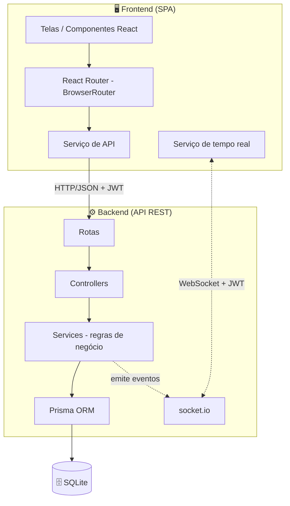
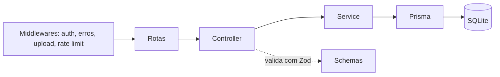
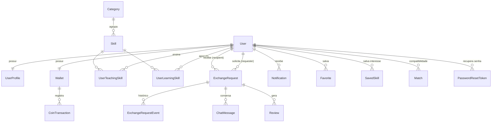
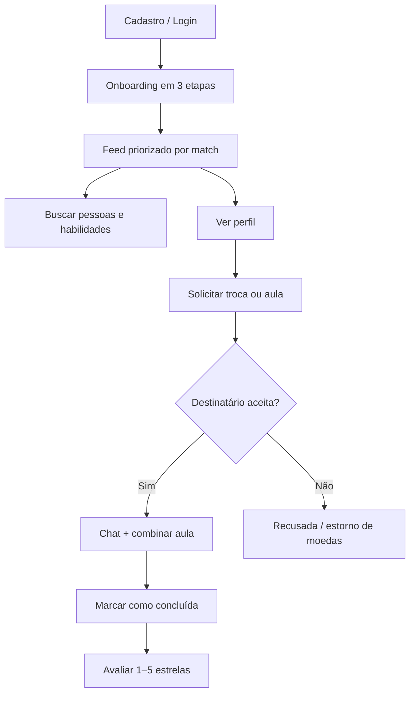
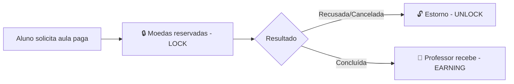

# 📑 Documentação Técnica — SkillEx

> Plataforma social de troca de habilidades
> Trabalho de Conclusão de Curso — Desenvolvimento de Sistemas

---

## Sumário

1. [Descrição do projeto](#1-descrição-do-projeto)
2. [Problema que a plataforma resolve](#2-problema-que-a-plataforma-resolve)
3. [Justificativa](#3-justificativa)
4. [Objetivos](#4-objetivos)
5. [Público-alvo](#5-público-alvo)
6. [Tecnologias utilizadas](#6-tecnologias-utilizadas)
7. [Arquitetura do sistema](#7-arquitetura-do-sistema)
8. [Modelagem do banco de dados](#8-modelagem-do-banco-de-dados)
9. [Algoritmo de match](#9-algoritmo-de-match)
10. [Funcionalidades e fluxo de uso](#10-funcionalidades-e-fluxo-de-uso)
11. [Sistema de moedas internas](#11-sistema-de-moedas-internas-skillcoins)
12. [Segurança e boas práticas](#12-segurança-e-boas-práticas)
13. [Estrutura de pastas](#13-estrutura-de-pastas)
14. [Telas da aplicação](#14-telas-da-aplicação)
15. [Melhorias futuras](#15-melhorias-futuras)

---

## 1. Descrição do projeto

A **SkillEx** é uma plataforma web, social e colaborativa, que conecta pessoas
interessadas em **ensinar e aprender habilidades entre si**. Inspirada em conceitos
de redes sociais (Instagram), marketplaces de serviços (GetNinjas) e comunidades de
aprendizagem, a plataforma permite que cada usuário cadastre as habilidades que sabe
ensinar e as que deseja aprender. A partir disso, um **algoritmo de compatibilidade**
sugere as melhores conexões — os chamados **Skill Exchanges** (trocas de habilidade).

O caso de uso central é a **troca recíproca**: uma pessoa que sabe tocar **violino** e
quer aprender **tricô** é conectada a outra que sabe **tricô** e quer aprender
**violino**. Quando não há uma habilidade compatível para oferecer, o usuário pode
**pagar a aula com uma moeda interna (SkillCoins)**, mantendo a economia da plataforma
em circulação.

## 2. Problema que a plataforma resolve

O acesso ao aprendizado de novas habilidades frequentemente esbarra em **barreiras
financeiras** (cursos caros) e na **dificuldade de encontrar a pessoa certa** para
ensinar algo específico. Ao mesmo tempo, muitas pessoas possuem conhecimentos valiosos
e tempo disponível, mas **não têm um canal** para compartilhá-los e obter algo em troca.

A SkillEx resolve essa lacuna ao:

- Reduzir o custo do aprendizado por meio da **troca direta de conhecimento**;
- Facilitar o **encontro entre pessoas compatíveis** com um algoritmo de match;
- Oferecer uma **alternativa monetária acessível** (moeda interna) quando não há troca direta;
- Criar uma **comunidade de aprendizagem** baseada em confiança (avaliações e reputação).

## 3. Justificativa

A economia colaborativa e a aprendizagem entre pares (*peer-to-peer learning*) são
tendências consolidadas. Plataformas que conectam oferta e demanda de serviços têm
grande relevância de mercado, porém poucas focam especificamente na **troca não-monetária
de habilidades** com um mecanismo inteligente de pareamento.

Do ponto de vista acadêmico, o projeto é rico por integrar, em um sistema funcional e
coeso, diversos conceitos fundamentais do desenvolvimento de sistemas: **modelagem
relacional**, **API REST**, **autenticação segura**, **regras de negócio com
transações**, **um algoritmo próprio de recomendação** e uma **interface responsiva
mobile-first**. Isso permite demonstrar domínio tanto de *back-end* quanto de *front-end*
e de banco de dados.

## 4. Objetivos

### Objetivo geral

Desenvolver uma plataforma web completa, responsiva e segura que permita a troca de
habilidades entre usuários, com um sistema inteligente de pareamento e uma economia
interna de moedas.

### Objetivos específicos

- Implementar **cadastro e autenticação** de usuários com senha criptografada;
- Permitir o cadastro de **habilidades que o usuário ensina e deseja aprender**;
- Desenvolver um **algoritmo de match** que pontue a compatibilidade entre usuários;
- Construir um **feed social** priorizado pela compatibilidade;
- Oferecer **busca avançada** com múltiplos filtros;
- Implementar o **ciclo completo de solicitações** (pendente → aceita → concluída);
- Criar um **sistema de moedas internas** com carteira, histórico e bloqueio temporário;
- Implementar **avaliações e reputação** para gerar confiança;
- Entregar uma **interface mobile-first**, moderna e intuitiva;
- Aplicar **boas práticas de segurança e organização de código**.

## 5. Público-alvo

- **Estudantes e autodidatas** que buscam aprender novas habilidades com baixo custo;
- **Profissionais e hobbistas** que desejam ensinar e, em troca, aprender algo novo;
- **Comunidades locais** interessadas em compartilhar conhecimento (idiomas, música,
  artesanato, tecnologia, culinária etc.);
- Pessoas que valorizam a **economia colaborativa** e o aprendizado entre pares.

## 6. Tecnologias utilizadas

| Camada | Tecnologia | Justificativa |
|--------|-----------|---------------|
| Linguagem | **TypeScript** | Tipagem estática reduz erros e melhora a manutenção |
| Runtime | **Node.js** | Ecossistema maduro, ótimo para APIs |
| Framework HTTP | **Express** | Simples, estável e amplamente documentado |
| ORM | **Prisma** | Schema legível, *migrations* e *seeds* nativos, consultas parametrizadas |
| Banco de dados | **SQLite** | Leve, sem servidor, ideal para execução local e demonstração |
| Autenticação | **JWT + bcryptjs** | Padrão de mercado, *stateless*, senha com *hash* |
| Validação | **Zod** | Validação e sanitização de dados de entrada |
| Upload | **Multer** | Envio de foto de perfil |
| Tempo real | **socket.io** | Notificações, chat e status ao vivo sobre o mesmo servidor HTTP |
| Segurança HTTP | **helmet + express-rate-limit** | *Headers* de segurança e limitação de requisições por IP |
| Build front-end | **Vite** | *Bundler* rápido com *hot reload* |
| PWA | **vite-plugin-pwa** | *Manifest* e *service worker* — aplicação instalável |
| Estilo | **SCSS** | CSS organizado com variáveis e aninhamento |
| Front-end | **React 18 + TypeScript (SPA)** | Componentização declarativa com React Router e Context API |

### Por que estas escolhas?

- **Express + Prisma + SQLite** formam uma base **simples de explicar e executar**, sem
  necessidade de instalar um servidor de banco de dados separado.
- O **front-end em React 18 + TypeScript** organiza a interface em componentes
  reutilizáveis, com navegação fluida (SPA com **React Router**), estado global via
  **Context API**, feed dinâmico e microinterações — mantendo o visual em **SCSS**.
- **Prisma** protege automaticamente contra **SQL Injection** (consultas parametrizadas)
  e gera um *schema* altamente legível — excelente para apresentar a modelagem.

## 7. Arquitetura do sistema

A aplicação segue o modelo **Cliente-Servidor** com uma **API REST** que separa
claramente as responsabilidades em três camadas independentes, complementada por um
**canal de tempo real** (WebSocket via socket.io) para notificações, chat e
atualizações de status sem recarregar a página.



### Camadas do backend



- **Rotas**: definem os *endpoints* e aplicam *middlewares*.
- **Controllers**: recebem a requisição, validam com **Zod** e chamam o *service*.
- **Services**: concentram as **regras de negócio** (match, transações de moedas, etc.).
- **Prisma**: acesso ao banco de dados com segurança e tipagem.

A organização é **modular por funcionalidade** (`auth`, `users`, `skills`, `feed`,
`match`, `requests`, `wallet`, `reviews`, `notifications`, `stats`, `admin`), o que
facilita a manutenção e a explicação de cada parte isoladamente.

### Camada de tempo real

O servidor **socket.io** roda sobre o **mesmo servidor HTTP** da API (porta 3333,
caminho `/socket.io`), sem processo adicional:

- **Autenticação do handshake** — o cliente envia o **mesmo JWT da API REST** ao
  conectar; a conexão é recusada sem token, com token inválido, para usuário
  inexistente ou com conta desativada;
- **Rooms** — cada conexão entra automaticamente na sala `user:<id>` (notificações e
  atualizações pessoais); ao abrir uma solicitação, o cliente pede entrada na sala
  `request:<id>` e o servidor **valida se ele é participante** antes de confirmar;
- **Eventos** — novas notificações, mudanças de status de solicitação e mensagens de
  chat são emitidos **somente após o *commit* das transações** no banco, garantindo
  que o cliente nunca receba um evento de algo que não foi persistido;
- **Frontend** — o serviço `services/realtime.ts` conecta no login e desconecta no
  logout, reentra automaticamente nas salas ao reconectar e ressincroniza o chat via
  REST ao confirmar a entrada na sala. O hook `useRealtime(event, handler)` assina
  eventos com múltiplos subscribers independentes e cancela automaticamente ao
  desmontar o componente, evitando vazamentos de memória.

Com isso, o selo de notificações, o chat e o status das solicitações **atualizam ao
vivo, sem recarregar a página**.

## 8. Modelagem do banco de dados



### Descrição das principais entidades

| Tabela | Descrição |
|--------|-----------|
| `users` | Dados principais e credenciais (e-mail, *hash* da senha, papel, conta ativa/inativa) |
| `user_profiles` | Dados complementares (gênero, nascimento, idiomas, disponibilidade) |
| `categories` | Categorias de habilidades (Música, Idiomas, Tecnologia…) |
| `skills` | Catálogo global de habilidades |
| `user_teaching_skills` | Habilidades que o usuário **ensina** (nível, modalidade, preço em moedas) |
| `user_learning_skills` | Habilidades que o usuário **deseja aprender** (objetivo, preferências) |
| `matches` | Cache/registro de compatibilidade calculada entre dois usuários |
| `exchange_requests` | Solicitações de troca ou aula paga (com status) |
| `exchange_request_events` | Histórico de mudanças de status de cada solicitação |
| `wallets` | Carteira de moedas (saldo disponível e saldo bloqueado) |
| `coin_transactions` | Histórico de todas as movimentações de moedas |
| `reviews` | Avaliações (1–5 estrelas) após trocas concluídas |
| `notifications` | Notificações internas |
| `favorites` | Usuários salvos como favoritos |
| `saved_skills` | Habilidades salvas como interesse (bookmark) |
| `chat_messages` | Mensagens trocadas dentro de uma solicitação aceita |
| `password_reset_tokens` | Tokens de recuperação de senha (hash SHA-256, expiração de 1h, uso único) |

> **Nota técnica:** o SQLite (via Prisma) não suporta o tipo `enum`. Por isso, campos
> com valores fixos (status, nível, modalidade) são `String` validados no *back-end*
> com Zod. Listas (idiomas, *tags*, disponibilidade) são armazenadas como **JSON em
> texto** e convertidas no código.

## 9. Algoritmo de match

O algoritmo calcula uma **pontuação de compatibilidade de 0 a 100** entre o usuário que
navega (**A**) e cada candidato (**B**). Ele é implementado como uma **função pura**
(sem acesso ao banco), o que facilita testes e a explicação acadêmica
(`backend/src/modules/match/match.algorithm.ts`).

### Critérios e pesos

| Critério | Peso | O que mede |
|----------|:----:|-----------|
| **Reciprocidade** | 50 | A quer o que B ensina **E** B quer o que A ensina (troca direta) |
| **Compatibilidade de habilidade** | 20 | Quanto dos objetivos de A o usuário B consegue ensinar |
| **Localização** | 8 | Mesma cidade (8) ou mesmo estado (4) |
| **Idioma** | 7 | Idiomas em comum |
| **Modalidade** | 7 | Online/presencial compatíveis |
| **Disponibilidade** | 5 | Horários em comum |
| **Atividade recente** | 3 | Usuários ativos têm leve prioridade |

### Fórmula

$$
\text{Score} = R_{(50)} + H_{(20)} + L_{(8)} + I_{(7)} + M_{(7)} + D_{(5)} + A_{(3)}
$$

Onde, sendo `d` = nº de habilidades que B ensina e A quer, e `r` = nº de habilidades
que A ensina e B quer:

- **Reciprocidade** $R = 50$ se `d > 0` **e** `r > 0`, senão `0`;
- **Compatibilidade** $H = 20 \times \min(1, d / |\text{aprender}_A|)$;
- Os demais critérios atribuem o peso total quando há compatibilidade, metade quando o
  dado é desconhecido (perfil incompleto) e zero quando incompatível.

### Classificação do match

- **PERFECT** (perfeito) — `d > 0` e `r > 0`: troca recíproca possível;
- **PARTIAL** (parcial) — apenas um lado compatível;
- **COIN_ONLY** — sem sobreposição de habilidades; interação apenas por moedas.

### Exemplo real (dados do seed)

| Usuário | Ensina | Quer aprender |
|---------|--------|---------------|
| **Bruno** | Tricô | Violino |
| **Ana** | Violino | Tricô |

- `d` (Ana ensina o que Bruno quer) = **1** (Violino)
- `r` (Bruno ensina o que Ana quer) = **1** (Tricô)
- Reciprocidade = **50** · Compatibilidade = 20 × (1/1) = **20**
- Mesma cidade (São Paulo) = **8** · Idioma/modalidade/disponibilidade/atividade ≈ **22**
- **Score final = 100 → Match perfeito** ⚡

Esse resultado foi validado na aplicação: ao acessar o feed como **Bruno**, a **Ana**
aparece no topo com **score 100** e o selo *Match perfeito*.

## 10. Funcionalidades e fluxo de uso



1. **Cadastro/Login** — criação de conta com bônus de boas-vindas em moedas.
2. **Onboarding** — completar perfil, informar o que ensina e o que quer aprender.
3. **Feed** — pessoas compatíveis, ordenadas pela pontuação de match.
4. **Busca** — filtros por habilidade, categoria, modalidade, cidade, nível etc.
5. **Solicitação** — troca direta (habilidade por habilidade) ou aula paga com moedas.
6. **Gestão** — aceitar, recusar, cancelar, conversar e concluir.
7. **Avaliação** — nota e comentário ao concluir, alimentando a reputação.
8. **Administração** — painel completo (restrito ao papel `ADMIN`) com visão geral de
   estatísticas, **gestão de usuários** (busca e ativar/desativar contas),
   **categorias** (CRUD) e **habilidades** (CRUD), com proteções de integridade
   (ex.: não excluir categoria com habilidades nem habilidade em uso).

## 11. Sistema de moedas internas (SkillCoins)

O sistema de moedas permite pagar por uma aula quando não há habilidade compatível para
trocar. O fluxo financeiro é **transacional e auditável**:



- **Saldo disponível** e **saldo bloqueado** são controlados separadamente.
- Ao solicitar, as moedas são **reservadas** (saem do disponível, entram no bloqueado).
- Se a solicitação é recusada ou cancelada, ocorre o **estorno**.
- Ao concluir, as moedas reservadas são **transferidas ao professor**.
- Todas as movimentações ficam registradas em `coin_transactions`.

A arquitetura já está preparada para evolução futura (carteira, histórico financeiro e
**solicitação de saque** em dinheiro real), mantida como funcionalidade futura no MVP.

## 12. Segurança e boas práticas

- **Senhas com hash** (bcrypt) — nunca armazenadas em texto puro;
- **Autenticação JWT** *stateless* com expiração;
- **Headers de segurança HTTP** com **helmet**;
- **Rate limiting por IP** (express-rate-limit) — limite global de **300 req/min** em
  `/api` e limite estrito de **10 req/15 min** nas rotas sensíveis de autenticação
  (login, cadastro e recuperação de senha), respondendo `429` quando excedido;
- **Health check com banco** — `GET /health` valida a conectividade com o banco
  (`SELECT 1` via Prisma) e responde `503` quando indisponível, útil para monitoramento;
- **Proteção contra SQL Injection** — consultas parametrizadas via Prisma;
- **Validação e sanitização** de toda entrada com Zod (validação nas bordas);
- **Prevenção de XSS** no front-end — React escapa automaticamente todo conteúdo dinâmico via JSX (nenhum uso de `dangerouslySetInnerHTML`);
- **Upload restrito** — tipos de imagem e tamanho máximo controlados;
- **Mensagens de erro genéricas** no login e **anti-enumeração de e-mails** no
  "esqueci minha senha" — a resposta é sempre a mesma, exista ou não a conta;
- **Tokens de recuperação de senha hasheados** — apenas o **hash SHA-256** do token é
  persistido no banco; o token expira em **1 hora**, é de **uso único** e gerar um
  novo invalida os anteriores;
- **CORS** configurado para a origem do front-end;
- **Variáveis de ambiente** para segredos (`.env`);
- **Tratamento global de erros** com respostas padronizadas;
- **Separação de camadas** e **código modular** por funcionalidade.

> **Limitação consciente — JWT *stateless* × desativação de conta:** o middleware de
> autenticação não consulta o banco a cada requisição (essa é justamente a vantagem do
> JWT *stateless*). Por isso, tokens já emitidos de uma conta desativada permanecem
> tecnicamente válidos até expirarem. A limitação é **mitigada** em três frentes: o
> `GET /auth/me` retorna `401` para contas inativas (derrubando a sessão no front-end
> na primeira verificação), o *handshake* do socket.io recusa a conexão, e contas
> desativadas são **ocultadas** do feed, da busca, do perfil público, dos favoritos e
> do ranking.

### LGPD — exclusão de conta

Em conformidade com a **LGPD** (direito de eliminação dos dados pessoais), o usuário
pode excluir a própria conta pela tela de configurações, com **dupla confirmação e
senha** (`DELETE /api/users/me`).

A estratégia adotada é a **anonimização**, e não a exclusão física (*hard delete*).
A justificativa é a **integridade referencial**: avaliações (`reviews`) e solicitações
(`exchange_requests`) não possuem exclusão em cascata — apagar fisicamente o usuário
quebraria esses vínculos e **apagaria avaliações recebidas por terceiros**, que fazem
parte da reputação de outras pessoas.

Ao excluir a conta:

- Solicitações **pendentes ou aceitas são canceladas**, com **devolução das moedas
  reservadas ao solicitante** (inclusive quando o solicitante é o outro usuário) e
  notificação ao outro participante;
- São **apagados** os dados pessoais: perfil complementar, habilidades de ensino e
  aprendizado, favoritos (nos dois sentidos), notificações, matches, carteira (com
  transações), tokens de recuperação de senha e o **arquivo físico do avatar**;
- O registro do usuário é **anonimizado** (`name = "Usuário removido"`, e-mail
  invalidado, senha inutilizada, `isActive = false`);
- Avaliações, solicitações históricas e mensagens de chat de **terceiros** são
  preservadas, exibindo "Usuário removido" no lugar da identidade.

## 13. Estrutura de pastas

```
SkillEx/
├── backend/
│   ├── prisma/
│   │   ├── schema.prisma        # modelagem do banco
│   │   ├── migrations/          # histórico de migrations
│   │   └── seed.ts              # dados fictícios
│   ├── src/
│   │   ├── config/              # env, prisma client
│   │   ├── middlewares/         # auth, erros, upload, rate limit
│   │   ├── modules/             # auth, users, skills, feed, match, requests,
│   │   │                        # wallet, reviews, notifications, stats, admin
│   │   ├── realtime/            # servidor socket.io e fachada de emissão
│   │   ├── routes/              # agregador de rotas
│   │   ├── utils/               # erros, jwt, senha, slug, constantes
│   │   ├── app.ts · server.ts
│   └── uploads/                 # fotos de perfil
├── frontend/
│   ├── src/
│   │   ├── components/          # AppLayout, guards, ScrollToTop, UserCard, ui/
│   │   ├── contexts/            # AuthContext, ToastContext
│   │   ├── hooks/               # useRealtime, useRequestRoom, useTheme
│   │   ├── pages/               # telas (feed, busca, perfil, carteira…)
│   │   ├── services/            # api, realtime
│   │   ├── styles/              # main.scss + partials (components/, pages/)
│   │   ├── utils/               # format, files
│   │   ├── App.tsx              # BrowserRouter + providers + rotas
│   │   └── main.tsx             # createRoot, shim hash→path, <App/>
│   ├── public/icons/            # ícones do PWA
│   └── index.html
└── docs/                        # esta documentação
```

## 14. Telas da aplicação

| Tela | Descrição |
|------|-----------|
| **Login / Cadastro** | Autenticação com identidade visual laranja |
| **Onboarding** | Assistente em 3 etapas (perfil → ensina → aprende) |
| **Feed** | Cards de usuários com anel de pontuação e selo de match |
| **Busca** | Campo de busca, chips de categoria e filtros avançados |
| **Perfil** | Foto, estatísticas, compatibilidade, habilidades e avaliações |
| **Editar perfil** | Dados básicos, complementares e upload de foto |
| **Habilidades** | Gerenciar o que ensina/aprende, salvar interesses e ver sugestões |
| **Solicitações** | Lista (recebidas/enviadas) e detalhe com histórico e chat |
| **Carteira** | Saldo, recarga e histórico de transações |
| **Favoritos** | Usuários salvos para revisitar |
| **Notificações** | Central de avisos internos |
| **Tendências** | Habilidades mais populares e desejadas (com salvar interesse) |
| **Ranking** | Reputação dos usuários (avaliações + trocas concluídas) |
| **Configurações** | Tema, alterar senha, sair e zona de perigo (excluir conta) |
| **Recuperação de senha** | "Esqueci minha senha" e redefinição via link com token |
| **Painel admin** | Visão geral, gestão de usuários, categorias e habilidades (somente administradores) |

A interface é **mobile-first**, com **navegação inferior**, **tema claro/escuro**,
estados visuais de **carregamento, vazio e erro**, e microinterações suaves.

A aplicação também é um **PWA** (*Progressive Web App*): possui *manifest* em
português, ícones próprios e *service worker* com atualização automática e pré-cache
dos arquivos estáticos, podendo ser **instalada no celular ou no desktop** como um
aplicativo. As rotas dinâmicas (`/api`, `/uploads` e `/socket.io`) **nunca passam pelo
cache** — vão sempre à rede, garantindo dados atualizados.

## 15. Melhorias futuras

- **Monetização real** — integração com gateway de pagamento e saque de moedas;
- **Match em tempo real** com pré-filtragem por SQL e paginação no banco (escala);
- **Notificações push** (Web Push) e **envio real de e-mails** — a recuperação de
  senha hoje é demonstrada sem servidor SMTP;
- **Geolocalização** para encontros presenciais próximos;
- **Agenda integrada** com confirmação de horários;
- **Sistema de denúncias** entre usuários (a moderação de contas já é possível pelo
  painel administrativo);
- **Aplicativo móvel nativo** (React Native/Flutter) consumindo a mesma API.

---

> 📌 Consulte também: [INSTALACAO.md](INSTALACAO.md) · [API.md](API.md) ·
> [ROTEIRO-APRESENTACAO.md](ROTEIRO-APRESENTACAO.md)
