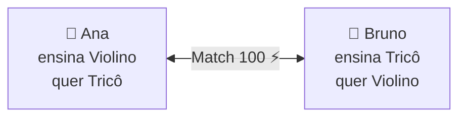

# 📚 Documentação do TCC — SkillEx

Bem-vindo à documentação da plataforma **SkillEx**. Os documentos estão organizados
para facilitar tanto a leitura acadêmica quanto a execução do projeto.

## Índice

| Documento | Conteúdo |
|-----------|----------|
| 📑 [DOCUMENTACAO-TCC.md](DOCUMENTACAO-TCC.md) | Documento acadêmico completo: descrição, objetivos, justificativa, arquitetura, modelagem, algoritmo de match, segurança e melhorias futuras |
| 🚀 [INSTALACAO.md](INSTALACAO.md) | Passo a passo de instalação, execução e contas de teste |
| 🔌 [API.md](API.md) | Referência de todos os *endpoints* da API REST |
| 🎤 [ROTEIRO-APRESENTACAO.md](ROTEIRO-APRESENTACAO.md) | Roteiro de demonstração e respostas para a banca |

## Resumo rápido

A **SkillEx** é uma plataforma social de **troca de habilidades**: o usuário ensina o
que sabe e aprende o que deseja. Um **algoritmo de compatibilidade** conecta as pessoas
certas, e uma **moeda interna** permite pagar aulas quando não há troca direta.

### Stack

`Node.js` · `TypeScript` · `Express` · `Prisma` · `SQLite` · `React 18` · `Vite` · `SCSS`

### Comece por aqui

1. Leia o [guia de instalação](INSTALACAO.md) para subir o projeto.
2. Consulte a [documentação acadêmica](DOCUMENTACAO-TCC.md) para entender as decisões.
3. Use o [roteiro de apresentação](ROTEIRO-APRESENTACAO.md) no dia da defesa.
